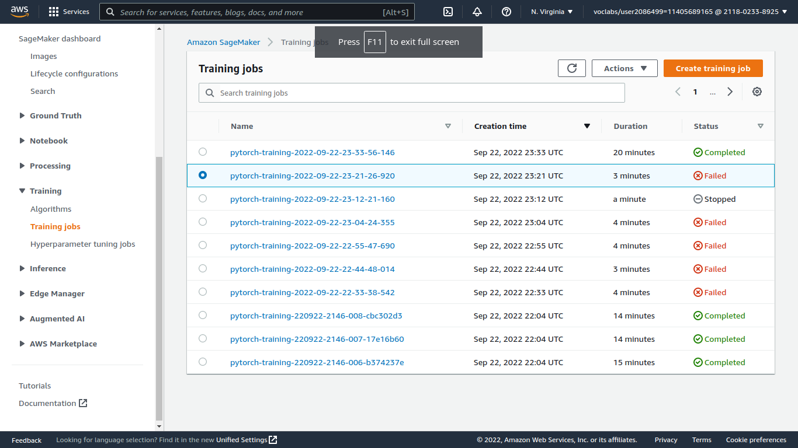
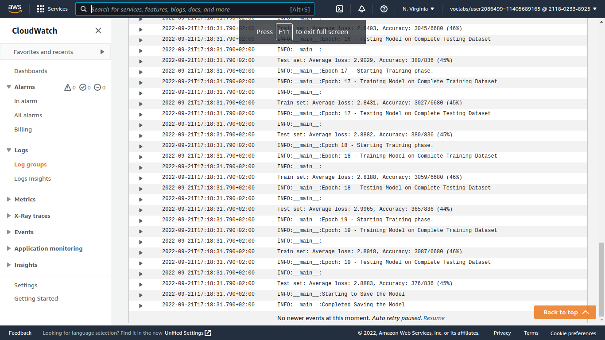
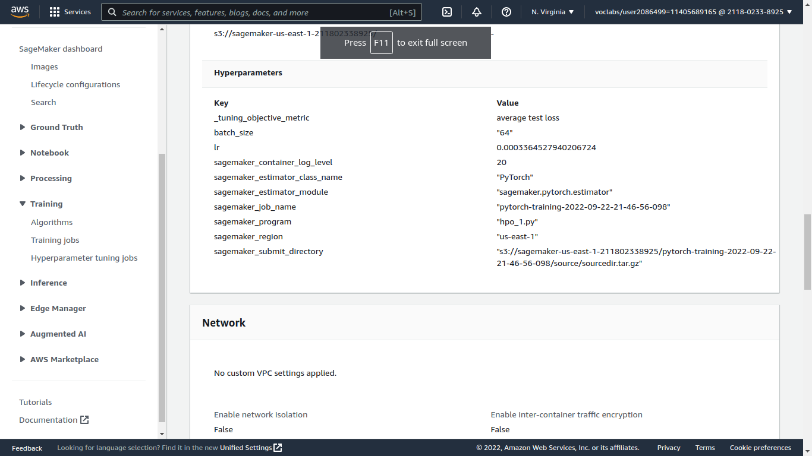
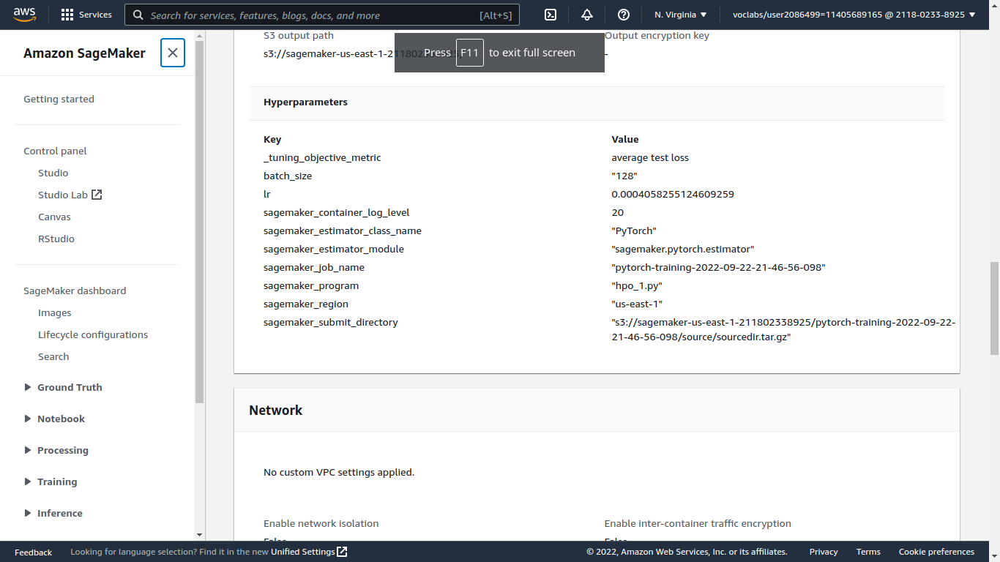
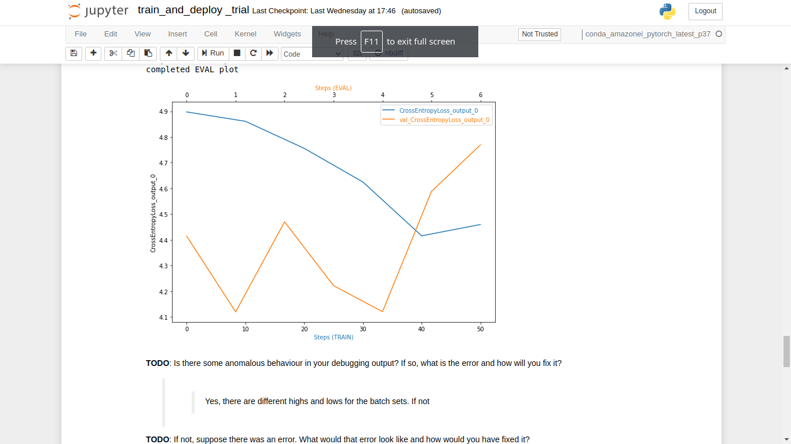
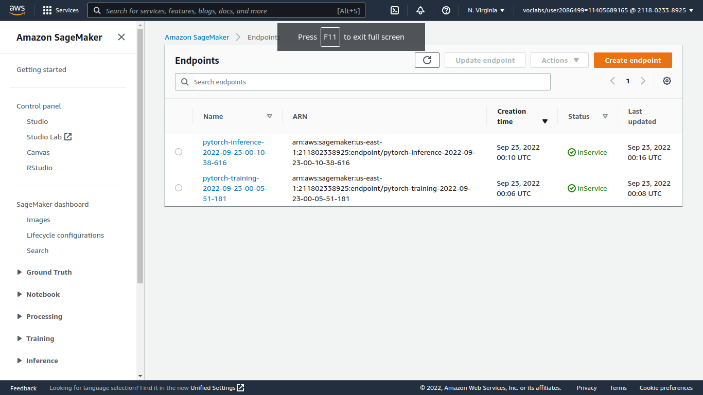

# Image Classification using AWS SageMaker

Use AWS Sagemaker to train a pretrained model that can perform image classification by using the Sagemaker profiling, debugger, hyperparameter tuning and other good ML engineering practices. This can be done on either the provided dog breed classication data set or one of your choice.

## Project Set Up and Installation
Enter AWS through the gateway in the course and open SageMaker Studio. 
Download the starter files.
Download/Make the dataset available. 

## Dataset
The provided dataset is the dogbreed classification dataset which can be found in the classroom.
The project is designed to be dataset independent so if there is a dataset that is more interesting or relevant to your work, you are welcome to use it to complete the project.

### Access
Upload the data to an S3 bucket through the AWS Gateway so that SageMaker has access to the data. 

## Hyperparameter Tuning
What kind of model did you choose for this experiment and why? Give an overview of the types of parameters and their ranges used for the hyperparameter search

* I used in my image classification process "Resnet50 model" as i learned from class it's prefered to be used in this kind of classification, after hyperparameters tuning i used which their ranges were
1.lr: (0.0001, 0.1)
2.batch_size: (64, 128)
could manage to use the best hyper parameters which were ('batch_size': 128, 'lr': '0.0002075107667149392') to get the best accuracy for my model.

Remember that your README should:
- Include a screenshot of completed training jobs

- Logs metrics during the training process

- Tune at least two hyperparameters

- Retrieve the best best hyperparameters from all your training jobs

## Debugging and Profiling

**TODO**: Give an overview of how you performed model debugging and profiling in Sagemaker

* Segemaker studio usage had been quiet difficult for me because of the budget consuming through the training jobs, but i could manage to use it to debuge my steps and enhance my model, also was helpful showing me my steps and errors through a clearful interface.

### Results
**TODO**: What are the results/insights did you get by profiling/debugging your model?
* Could find that the curve wasn't smooth and i may need to enhance my model may be through different neural network design.

**TODO** Remember to provide the profiler html/pdf file in your submission.

## Model Deployment
**TODO**: Give an overview of the deployed model and instructions on how to query the endpoint with a sample input.
* In this exact point i faced some troubles using the suitable instance type for the job, i've got stuck many times but after all i realized that ml.t2.medium would solve it all. and it ran smoothly after that.

**TODO** Remember to provide a screenshot of the deployed active endpoint in Sagemaker.

## Standout Suggestions
**TODO (Optional):** This is where you can provide information about any standout suggestions that you have attempted.
